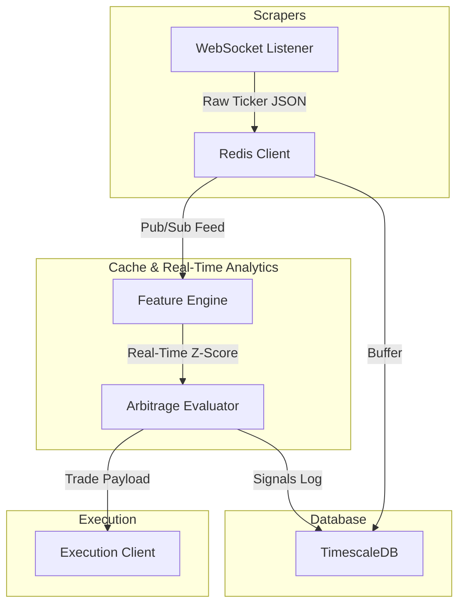

# NBA Player Points StatArb Engine (Version 1)

An institutional-grade, event-driven quantitative system designed for detecting and executing Sports Statistical Arbitrage (StatArb) opportunities in the NBA Player Points prop markets. The engine prioritizes market microstructure anomalies (e.g., latency arbitrage, stale lines, and cross-bookmaker drift) over slow-moving directional prediction.

---

## Abstract

Prop betting markets (specifically NBA Player Points) exhibit high fragmentation and localized liquidity. Since distinct bookmakers utilize different oddsmaking models, feeds, and risk management profiles, rapid shifts in player availability, sharp action, or game state updates generate brief microstructural imbalances. 

This engine is built to scrape real-time feeds from sharp oddsmakers (anchoring the "true" implied probabilities) and compare them with retail or slow-moving bookmakers to find statistically significant price discrepancies (positive expected value). The strategy executes high-frequency, short-duration trades to capture stale lines before the wider market adjusts.

---

## System Architecture

The infrastructure relies on a hybrid low-latency setup to handle high-throughput ticks and execute orders within millisecond windows.



### 1. In-Memory Cache (Redis)
- **Role**: Pub/Sub broker and transient state storage.
- **Implementation**: Utilizes a connection pool (`redis_client.py`) to buffer incoming market updates, tracking the active state of lines across bookmakers.
- **Latency Target**: < 1ms retrieval for active lines.

### 2. Time-Series Storage (TimescaleDB)
- **Role**: Long-term historical tick storage, audit trails, and execution performance tracking.
- **Hypertable Design**: Uses partition intervals on `timestamp` columns (`db_schema.sql`) to scale writes up to millions of events per day.

---

## Feature Engineering (XGBoost & ZINB)

To model the true distribution of NBA player points, the feature engine combines machine learning classifiers and specialized count data models.

1. **Stale Line Detection**:
   - **Features**: Time since last update, bookmaker revision rates, trade volume imbalances, bid-ask spread widths.
   - **XGBoost Classifiers**: Trained to predict the probability of a line being revised within $t + \Delta t$ seconds, determining if a deviation represents a tradable opportunity or toxic order flow.

2. **Player Prop Distribution**:
   - **Zero-Inflated Negative Binomial (ZINB)**: Since NBA points are discrete non-negative counts with a variance exceeding the mean (overdispersion), and zero points has a distinct probability (due to early injury or DNP), a ZINB model from `statsmodels` is utilized to model the true probability density function $P(Y = y)$.

---

## Risk Management (Multivariate Kelly)

Rather than running simple univariate Kelly sizing which risks over-exposure across highly correlated outcomes, the engine utilizes a **Multivariate Kelly Criterion** framework to optimize capital allocation.

Given a set of simultaneous arbitrage opportunities:
- The correlation matrix $\Sigma$ is computed using historical player points covariance.
- Sizing fractions vector $f^*$ is calculated by solving:
$$\max_{f} \left( r + f^T \mu - \frac{1}{2} f^T \Sigma f \right)$$
subject to total exposure constraints:
$$\sum |f_i| \le \text{Max Leverage}$$

This guarantees optimal growth of bankroll while penalizing bets on highly correlated players (e.g., teammates whose points are negatively correlated, or opposing players in high-tempo games).

---

## Directory Structure

```text
├── .env.example
├── .gitignore
├── README.md
├── requirements.txt
├── data/
│   ├── processed/
│   └── raw/
├── execution/
│   └── __init__.py
├── features/
│   └── __init__.py
├── infrastructure/
│   ├── __init__.py
│   ├── db_schema.sql
│   └── redis_client.py
├── models/
│   └── __init__.py
├── notebooks/
└── scrapers/
    ├── __init__.py
    └── websocket_listener.py
```

---

## Quick Start

### Installation
1. Clone the repository and navigate to the project directory:
   ```bash
   git clone https://github.com/Jonathan0607/Sports-Statistical-Arbitrage.git
   cd Sports-Statistical-Arbitrage
   ```
2. Set up virtual environment and install dependencies:
   ```bash
   python3 -m venv venv
   source venv/bin/activate
   pip install -r requirements.txt
   ```
3. Initialize the environment configuration:
   ```bash
   cp .env.example .env
   # Populate environment variables in .env
   ```
