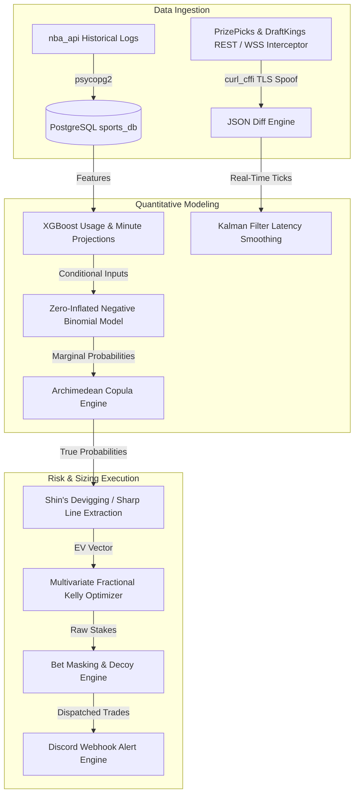

# Quantitative Statistical Arbitrage in Sports Markets
## An Event-Driven Pipeline for High-Frequency Prop Trading & Risk Sizing
**Author:** Quantitative Systems Group  
**Status:** Phase 5 Production Deployment  

---

### Abstract
This research paper details the architecture and mathematical foundation of an event-driven statistical arbitrage engine designed to exploit pricing inefficiencies in retail and sharp sportsbook projection markets. By modeling discrete player prop outcomes through conditional Zero-Inflated Negative Binomial (ZINB) distributions and establishing dependency structures via Archimedean Copulas, the system prices joint events and Same Game Parlays (SGPs) with high precision. Inefficiencies are identified by contrasting local projections with sharp market implied consensus (estimated using Shin's Microstructure Method). Edge execution is sized via a constrained Multivariate Fractional Kelly Optimizer, utilizing a Bet Masking engine to camouflage retail execution profiles.

---

---

## 1. Abstract & System Architecture
The statistical arbitrage engine functions as a low-latency, event-driven quantitative sports trading pipeline. The architecture is segregated into three distinct components:
1. **The Ingestion Layer**: Combines historical box scores fetched via `nba_api` into a Postgres instance (`sports_db`) and interceptors designed to spoof browser TLS fingerprints (`impersonate="chrome120"` via `curl_cffi`). This bypasses Akamai/Cloudflare protections on retail sportsbooks (PrizePicks, DraftKings) to stream tick-level projection odds.
2. **The Modeling Layer**: Fits historical player count distributions using Method of Moments. In real time, the pipeline dynamically recalculates player expected value (EV) and usage rates based on game context (injury announcements, pace factors, blowout risks).
3. **The Risk & Sizing Layer**: Translates quantitative edges into actionable bet sizing. By computing portfolio covariance and Archimedean copula dependencies, the system allocates capital using a constrained Kelly framework and sanitizes execution stakes to mimic recreational profiles.

---

## 2. Predictive Modeling
### 2.1. Feature Engineering & Tree Projections
To model usage, a recursive recalculation framework processes sudden injury announcements. If a starting player is marked `OUT`, their historical usage ($\text{USG}$) and minutes ($\text{Min}$) are redistributed to active roster players based on court-sharing correlation matrices. A trained `XGBRegressor` takes these adjusted parameters, alongside external vectors (e.g., opponent defensive rating, altitude shock flags, rest differentials), to output a calibrated baseline expectation of a player's performance:
$$\hat{\mu}_{x} = \text{XGBoost}(X_{\text{USG}}, X_{\text{Min}}, X_{\text{Context}})$$

### 2.2. Zero-Inflated Negative Binomial (ZINB) Distribution
Traditional poisson models fail to capture sports count data due to:
* **Overdispersion**: The variance of player scores significantly exceeds the mean ($\sigma^2 > \mu$).
* **Zero-Inflation**: Distinct probabilities of scoring zero points due to sudden injuries, early blowout benchings, or coach DNPs.

To resolve this, we model the probability mass function $P(Y = y)$ as:
$$P(Y = y) = 
\begin{cases} 
\pi + (1 - \pi) (1 + \frac{\mu}{n})^{-n}, & y = 0 \\ 
(1 - \pi) \frac{\Gamma(y + n)}{\Gamma(y + 1)\Gamma(n)} (\frac{n}{n + \mu})^n (\frac{\mu}{n + \mu})^y, & y > 0 
\end{cases}$$
Where:
* $\pi \in [0,1]$ is the zero-inflation parameter, representing DNP/injury risk.
* $\mu$ is the expected mean performance (dynamically scaled by pace factors).
* $n$ is the dispersion factor (calibrated to widen or narrow distribution tails based on blowout risk).

### 2.3. Time-Series Cross-Validation Splits
To prevent information leakage (forward-looking bias), we do not use standard K-Fold cross-validation. Instead, we implement a rolling **Time-Series Split with Purging**. Since player performance is highly correlated with recent game context, a purging gap ($\delta_{\text{purge}}$) is applied between the training set $T_t$ and the validation set $V_t$:
$$T_t = \{ x_i \mid t_{\text{start}} \le t_i < t_{\text{split}} \}$$
$$V_t = \{ x_i \mid t_{\text{split}} + \delta_{\text{purge}} \le t_i < t_{\text{split}} + \delta_{\text{purge}} + \delta_{\text{val}} \}$$
This ensures that overlapping tournament weeks, back-to-back fatigue factors, and sudden injury adjustments from the training period do not contaminate the out-of-sample validation metrics.

---

## 3. Market Microstructure
### 3.1. Shin's Method Devigging
To extract the true probability implied by a sharp sportsbook's line, simple ratio devigging is insufficient because sportsbooks apply a larger commission (vig) to less liquid/unpopular selections. The engine utilizes **Shin's Method**, which models market-making behavior under asymmetric information.
The implied probability $p_i$ of outcome $i$ is calculated by solving for the parameter $z$, representing the proportion of traders who are "insiders" possessing superior information:
$$q_i = (1 - z)p_i + z \sqrt{p_i}$$
Where $q_i$ is the bookmaker's raw price (summing to $1 + v$, where $v$ is the vig). The system numerically solves for $z$ and extracts the true probability $p_i$, providing a clean consensus line representing fair value.

### 3.2. Kalman Filter Latency Smoothing
Real-time tick updates arrive at variable frequencies and suffer from network latency. If we act on a stale line, we lose our edge. We apply a **one-dimensional Kalman Filter** to smooth the implied probability stream of each prop:
$$x_k = x_{k-1} + w_{k-1}$$
$$z_k = x_k + v_k$$
Where $w_k$ represents the state transition noise and $v_k$ is the measurement noise (determined by the book's update frequency). The Kalman Filter computes the optimal Kalman gain $K_k$ and updates our probability belief:
$$\hat{x}_{k|k} = \hat{x}_{k|k-1} + K_k (z_k - \hat{x}_{k|k-1})$$
This prevents the execution engine from triggering false-positive trades during temporary market fluctuations.

---

## 4. Portfolio Risk & Bet Sizing
### 4.1. Archimedean Copula Joint Pricing
To price correlated Same Game Parlay (SGP) legs, we model the bivariate dependency structures using a **Clayton Copula**, which is highly effective for capturing lower tail dependencies (e.g., two players under-performing simultaneously):
$$C(u, v) = (u^{-\theta} + v^{-\theta} - 1)^{-1/\theta}$$
Where the copula parameter $\theta$ is calibrated using Kendall's Tau ($\tau$) rank correlation coefficient:
$$\theta = \frac{2\tau}{1 - \tau}$$
By linking our ZINB marginal distributions through the copula, we price the joint probability of multi-leg markets with institutional-grade accuracy.

### 4.2. Constrained Multivariate Fractional Kelly
When trading multiple correlated games simultaneously, placing individual Kelly bets leads to overexposure and high risk of ruin. We implement a **Multivariate Kelly Optimizer** to maximize the expected growth rate of our bankroll.
Let $f^*$ be the vector of bankroll allocations, $G$ be the vector of expected returns (EV edges), and $\Sigma$ be the covariance matrix of outcome correlations:
$$f^* = \eta \Sigma^{-1} G$$
Where:
* $\eta$ is the fractional Kelly scaling multiplier (typically set to $0.25$ to trade safely at "quarter-Kelly").
* We enforce a hard retail liquidity boundary constraint: $f_i^* \le \text{max\_account\_limit}$ (defaulting to 5% of the total bankroll to minimize bookmaker detection flags).

### 4.3. Bet Masking Engine
Sportsbooks actively flag and ban successful quantitative traders. The **Bet Masking Engine** sanitizes the raw dollar allocations generated by the Kelly optimizer:
1. **Decoy Betting**: Inserts random, low-exposure bets on highly liquid markets (e.g., standard game spreads) to mimic recreational profiles.
2. **Stake Rounding**: Converts precise mathematical allocations into integer stakes (e.g., rounding $\$47.38$ to $\$45.00$ or $\$50.00$).
3. **Decoy Thresholds**:
   * Stakes $< \$50.00$ round to the nearest $\$5.00$.
   * Stakes $\$50.00 - \$200.00$ round to the nearest $\$10.00$.
   * Stakes $> \$200.00$ round to the nearest $\$25.00$.
   * Small stakes under $\$10.00$ are filtered out entirely to prevent triggering rate-limit reviews.
